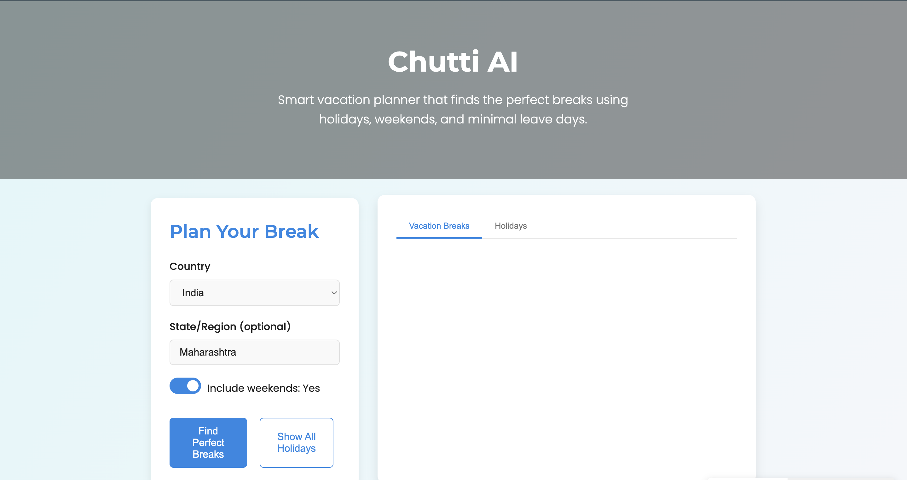

# Chutti AI - Smart Vacation Planner
[](LICENSE) [](https://github.com/shubhamekapure/Chutti-AI/issues) [](https://github.com/shubhamekapure/Chutti-AI/pulls)


Chutti AI is an intelligent vacation planning tool that helps you discover perfect breaks by combining:
- Public holidays (from Calendarific API)
- Weekends (configurable)
- Minimal optional leave days (smart optimization)

The tool identifies potential vacation breaks with at least 5 days total duration, requiring only 1 optional leave day, and leveraging official holidays and weekends.

## 🌟 Features

- **Smart Break Detection**: Finds optimal vacation periods requiring minimal leave days
- **Global Holidays**: Supports 230+ countries with real-time holiday data
- **Intuitive UI**: Beautiful, responsive interface with intuitive controls
- **Day-by-Day Breakdown**: Detailed visualization of each day in your break
- **Holiday Explorer**: Browse all holidays for your location and timeframe

## 🚀 Live Demo

[View Live Demo](#) _(Coming Soon)_

## 📸 Screenshots



## 🛠️ Setup & Installation

### Prerequisites
- Python 3.7+
- Calendarific API key ([Get one here](https://calendarific.com/api-documentation))

### Installation

1. Clone the repository
   ```bash
   git clone https://github.com/shubhamekapure/Chutti-AI.git
   cd Chutti-AI
   ```

2. Create a Python virtual environment and activate it
   ```bash
   python3 -m venv venv
   source venv/bin/activate
   ```

3. Install dependencies
   ```bash
   pip install -r requirements.txt
   ```

4. Copy the `.env.template` to `.env` and fill in your Calendarific API key
   ```bash
   cp .env.template .env
   # then edit .env to include:
   CALENDARIFIC_API_KEY=your_api_key_here
   ```

5. Start the backend server
   ```bash
   python3 backend/app.py
   ```

6. In a new terminal, start the frontend server
   ```bash
   cd frontend
   python -m http.server 8000
   ```

7. Open your browser and navigate to `http://localhost:8000`

## 🔍 How to Use

1. **Select a Country**: Choose from the dropdown list
2. **Enter State/Region** (optional): For more localized holidays
3. **Include Weekends**: Toggle on/off depending on your preference
4. **Find Perfect Breaks**: Click to discover optimal vacation periods
5. **View Holidays**: Click to see all holidays for your selected region

## 🧠 How It Works

Chutti AI analyzes calendar data to find breaks that meet these criteria:
- At least 5 days total duration
- Maximum 2 weekend days
- Maximum 1 optional leave day
- Rest are genuine holidays

It presents these breaks in an easy-to-understand format, showing exactly which days are holidays, weekends, and where you need to use leave days.

## 🤝 Contributing

Contributions are welcome! Please feel free to submit a Pull Request.

1. Fork the repository
2. Create your feature branch (`git checkout -b feature/amazing-feature`)
3. Commit your changes (`git commit -m 'Add some amazing feature'`)
4. Push to the branch (`git push origin feature/amazing-feature`)
5. Open a Pull Request

## 📝 License

This project is licensed under the MIT License - see the [LICENSE](LICENSE) file for details.

## 🙏 Acknowledgements

- [Calendarific API](https://calendarific.com/) for holiday data
- [Unsplash](https://unsplash.com/) for banner images
- [Feather Icons](https://feathericons.com/) for UI icons

---

Made with ❤️ by Shubham
